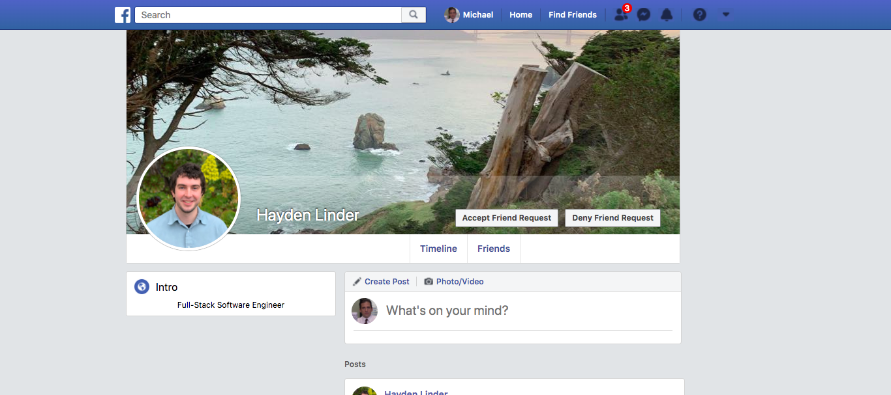

# Febacook
[Live Site](https://febacook.herokuapp.com/#/)

Febacook is a Facebook clone that allows users to create accounts, make friends, and share, like, and comment on ideas and photos. 



# Technologies Used
This single-page app uses a Ruby on Rails backend API to serve a React-Redux frontend. Photos are uploaded to Amazon S3 via Rails' Active Storage.

# Features
* A user-chosen url handle allows for easy sharing of profiles, but requires some customization of how data is referenced. 

  * For instance, the keys in the frontend's `users` slice of state are usernames (url handles) that point to user objects:

``` jsx
users: {
    user1: {
        username: user1
        firstName: user
        lastName: one
        .
        .
        .
    }
}
```

  * Consequently, associated objects must also reference usernames when sent up from the backend:

``` ruby
json.extract! post, 
    :body, :photos, :created_at, :updated_at, :author_id, :recipient_id

hash = { 
    authorName: post.author.username, 
    recipientName: post.recipient.username 
}

json.merge! hash 


```

* Associated data is eagerly loaded from the back, allowing each page to load quickly.

``` ruby
def show
    @user = 
        User.includes(received_posts: [:author, :recipient])
        .find_by(username: params[:username])

    unless @user
        render json: @user.errors, status: 404
    end
    @users = @user.received_posts.map { |post| post.author }
    @users.push(@user) 
    render :show
end
```


